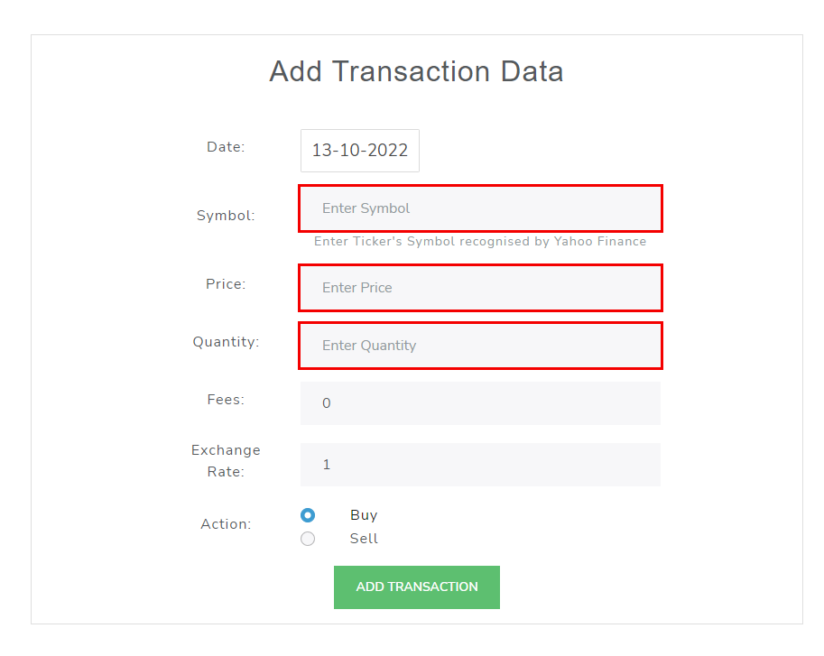
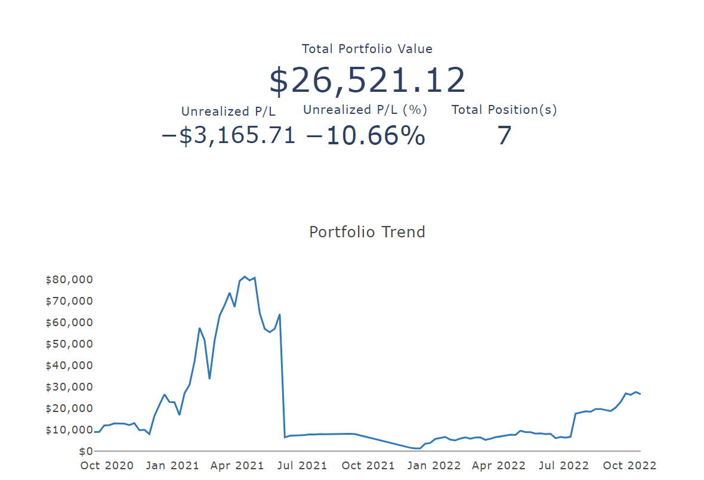
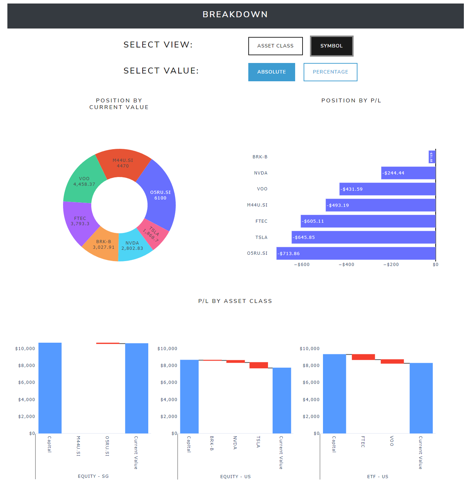
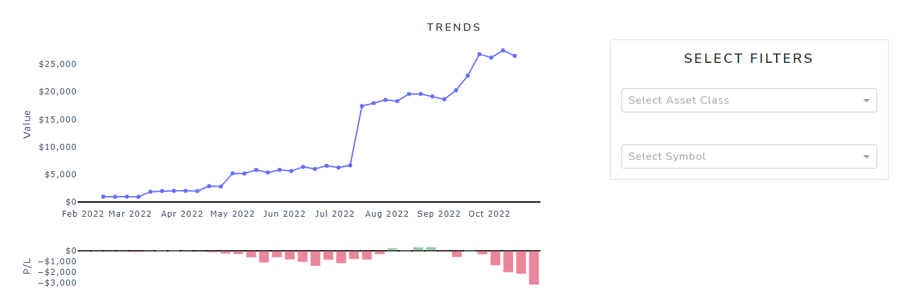
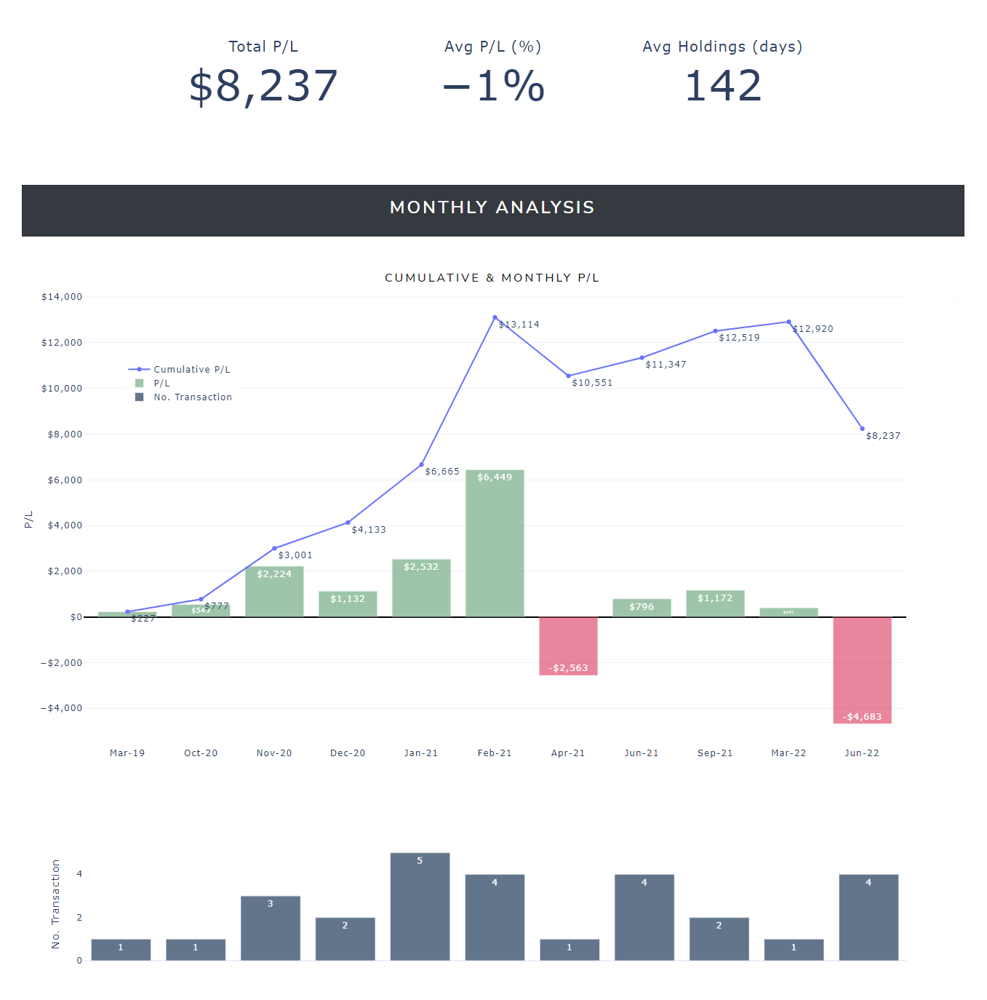
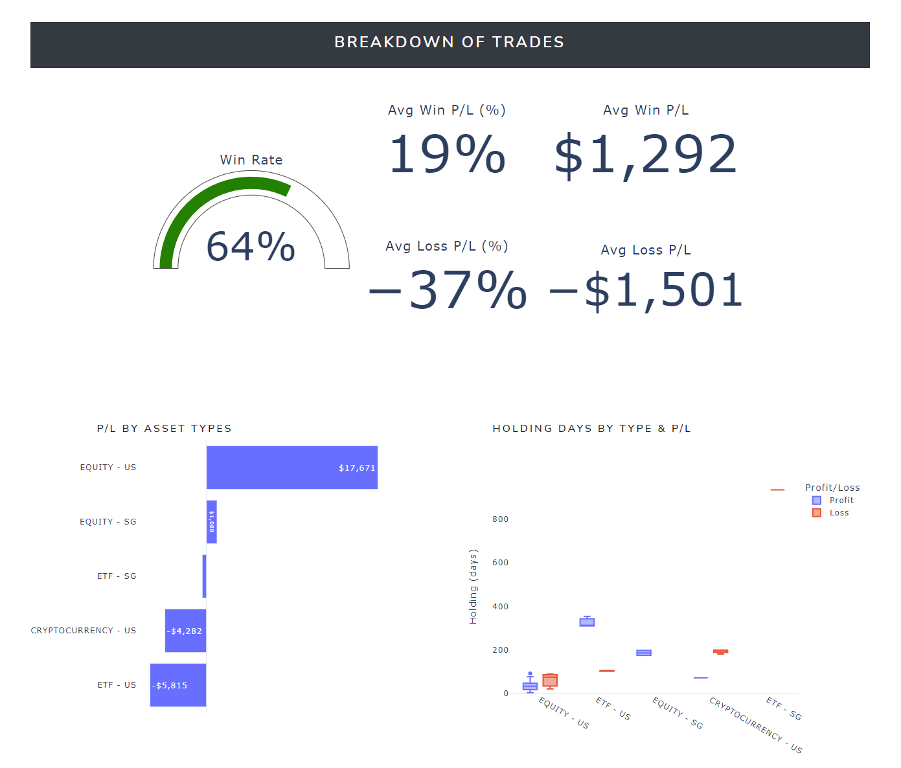
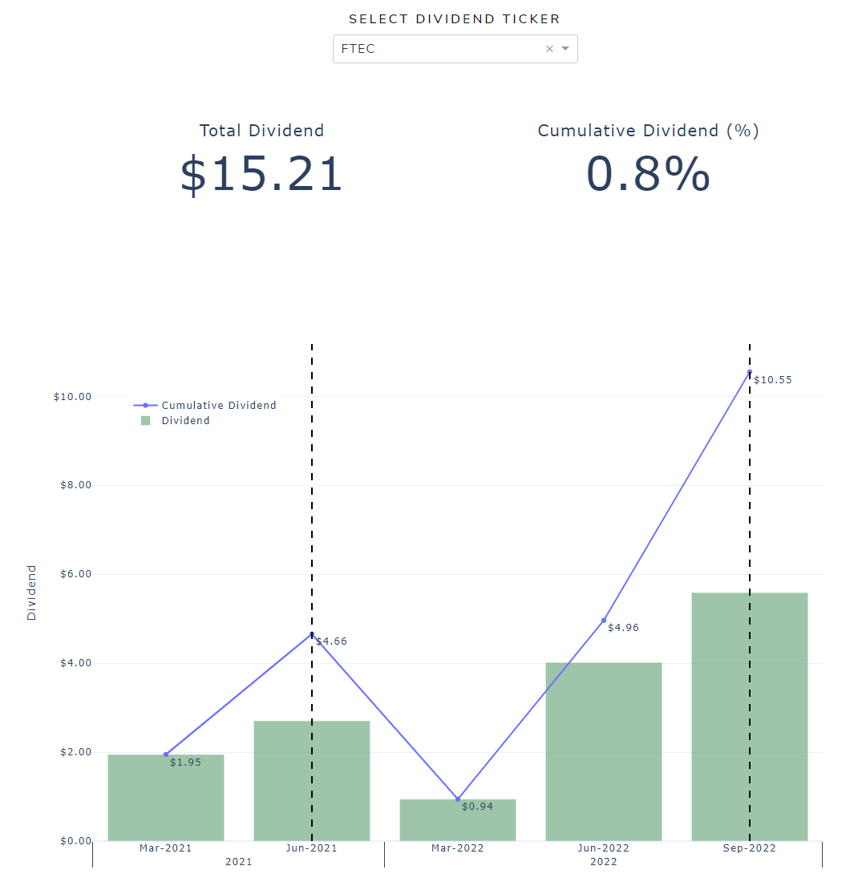
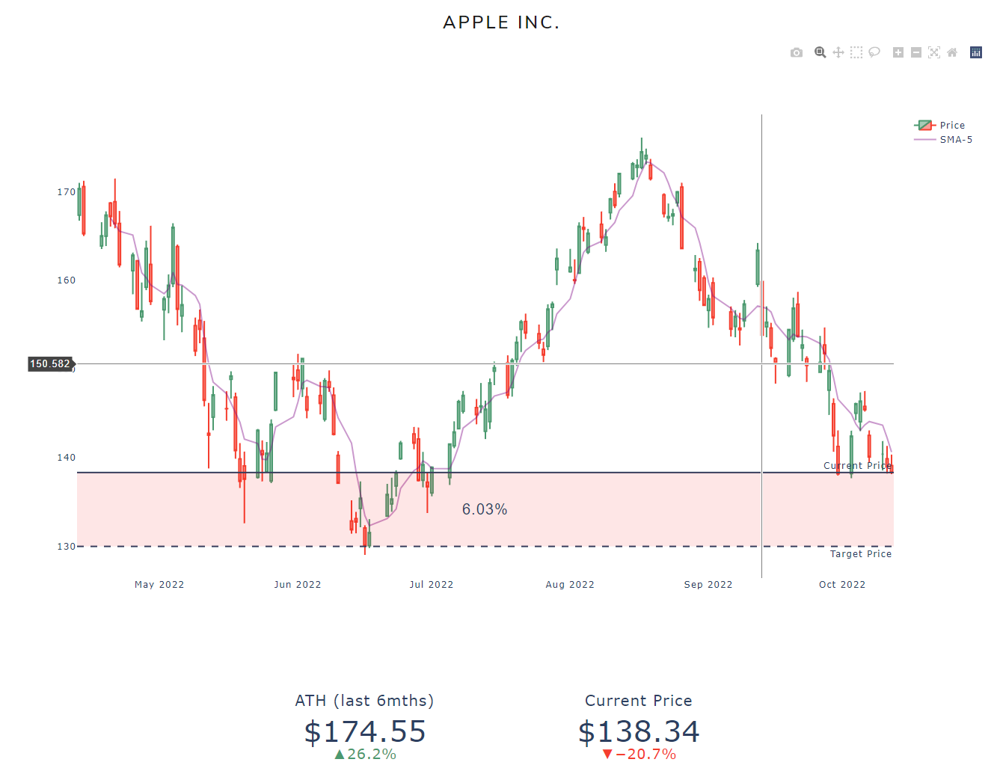

# Trading Dashboard
Trading Dashboard is a full-stack web app that tracks investment portfolio for multiple asset classes

## Motivation
Most web/mobile apps that track investment portfolio only allow tracking of a single asset class (e.g. Equities). This become an issue when your investment portfolio consists of multiple asset classes and you start to manage multiple apps to monitor your porftolio.

Trading Dashboard uses yahoo finance API to retrieve the most updated ticker price for all asset classes, including but not limited to:
1. Equities
2. Cryptocurrency
3. Commodity

## Overview
Using transactions entered by the user through a frontend User Interface (UI), the backend API handles the appropriate operations and store them in database.

Operation such as:
1. Open new position in portfolio
2. Update existing position in portfolio
3. Closed existing position in portfolio

## Analysis
Open and closed positions are then analysed separately.

### Open Positions (Portfolio)
For positions within the current active portfolio, updated prices will be retrieved from yahoo finance API to compute:
1. Portfolio Value
2. Profit/Loss (P/L)

### Closed Positions
Else for closed positions, P/L and holding period will be generated for each position to analyse historical trades.

## Technology Used
1. Web Frontend - Dash Plotly (Python)
2. Backend API - Django Restful API (Python)
3. Database - Sqlite3 (RDBMS)

## Demo

### Portfolio Management

### Closed Position Analysis

## Enhancement/Features Added

1. Dividend Tracker  
If dividend ex-date occurred during the stock holding period, dividend will be retrieved using yahoo finance API

2. Watchlist  
Watchlist functionality is added with the ability to set and monitor target prices.

